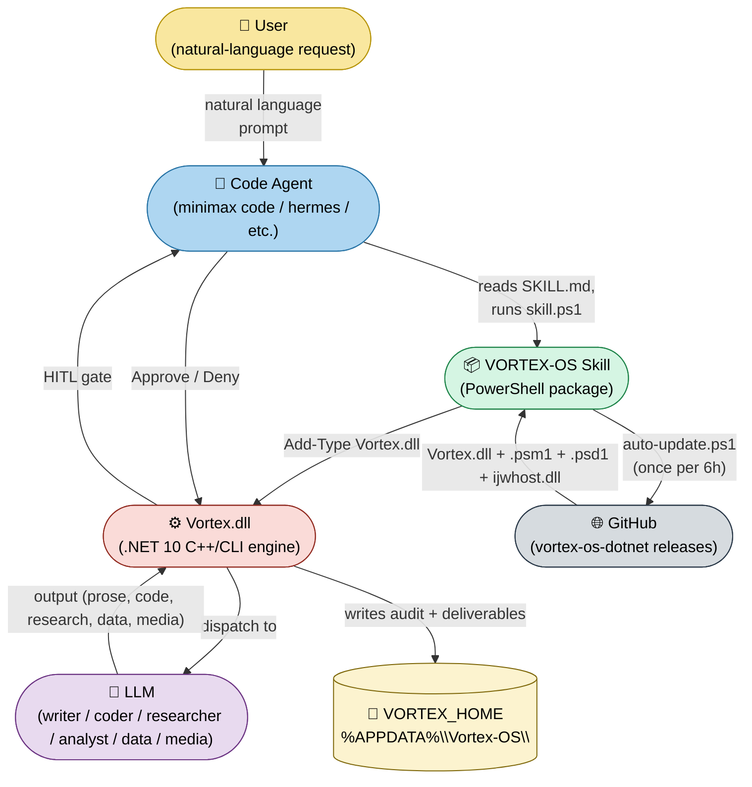
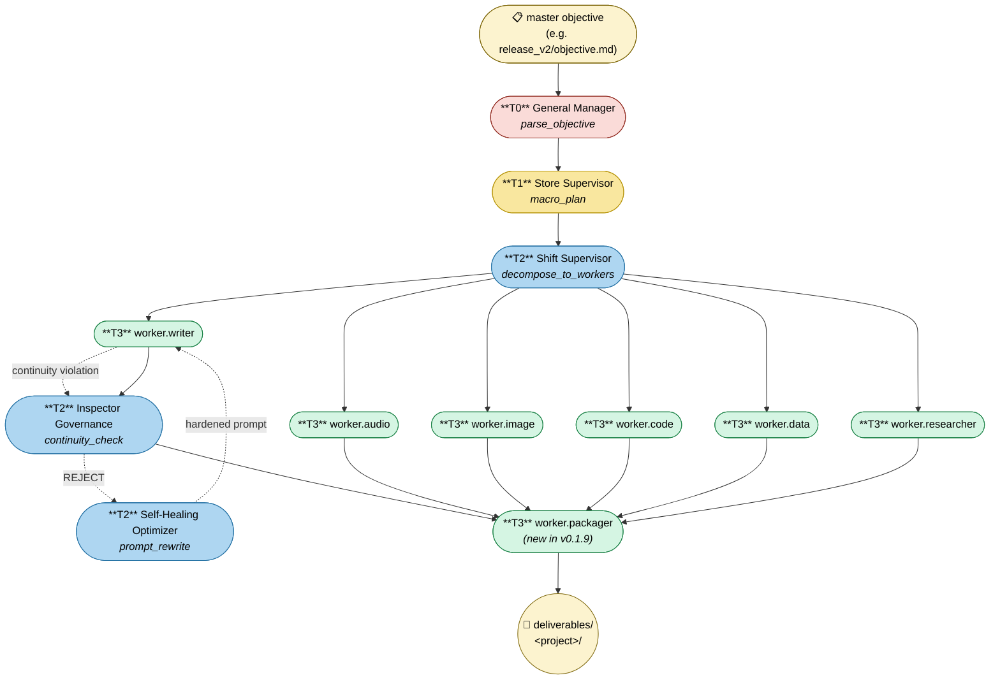
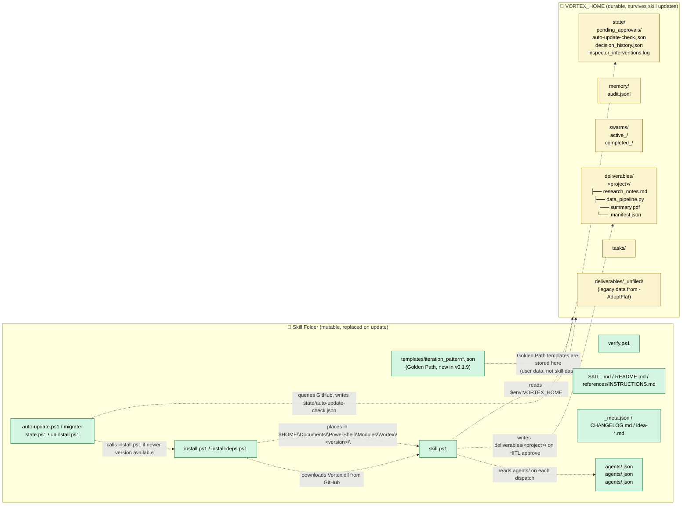
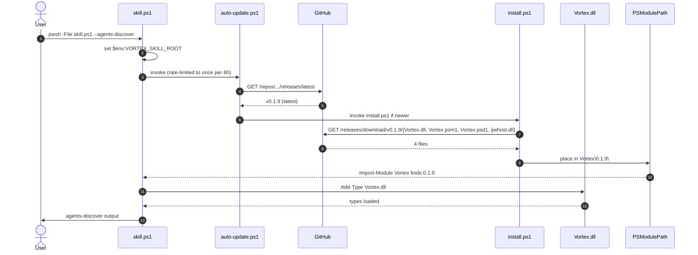
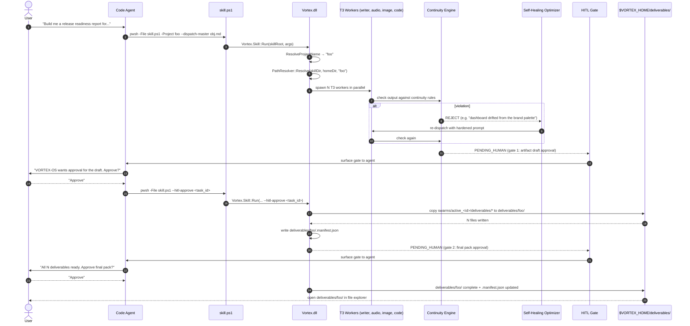
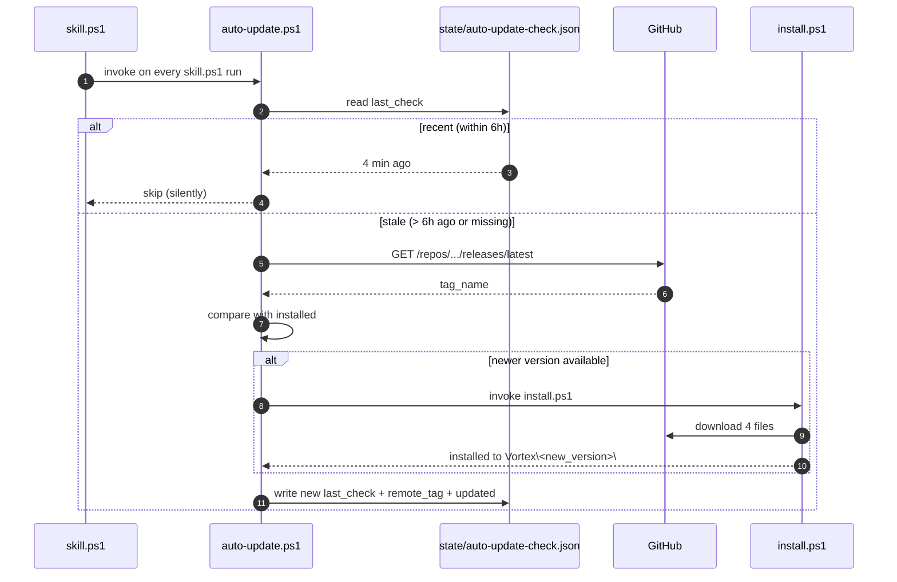
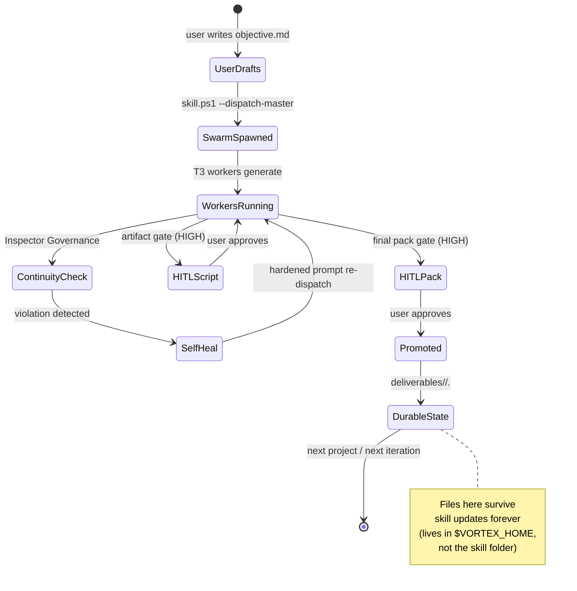

# VORTEX-OS — Architecture

> **Status:** Living document. Update when the architecture changes (any of ADR-001 through ADR-015).
> **Audience:** Anyone wanting a visual map of how VORTEX-OS fits together.
> **Scope:** Both [`vortex-os-dotnet`](https://github.com/Cloudmeru/vortex-os-dotnet) (the .NET 10 C++/CLI engine) and [`vortex-os-skill`](https://github.com/Cloudmeru/vortex-os-skill) (the PowerShell skill package).

This document is the **visual companion** to `idea-architecture-decisions.md`. Where the ADRs explain the *why* behind each design choice in prose, this file shows the *what* as diagrams.

---

## The big picture

Read it left to right: the user types a request, the code agent reads the skill and invokes it, the skill installs the engine from GitHub, the engine dispatches to LLMs, results go to durable state, and HITL gates are surfaced back to the user.

---

## The 4-tier agent chain

This is the core orchestration pattern. The engine decomposes a master objective into 4 layers:

Read top-to-bottom:
- **T0** parses the master objective into a macro plan
- **T1** (Store Supervisor) decomposes into per-domain tasks
- **T2** (Shift Supervisor) dispatches to T3 workers in parallel
- **T2b** (Inspector) checks every worker output against the continuity rules; rejects on violation
- **T2c** (Self-Healing Optimizer) rewrites the offending prompt with explicit constraints
- **T3 workers** (writer / audio / image / code / data / researcher / packager) generate the deliverables
- **T3 packager** promotes the swarm's intermediate deliverables to the durable `deliverables/<project>/` location (new in v0.1.9)

The self-heal loop (T3w → T2b → T2c → T3w) is what makes the engine "recover from LLM drift" without human intervention. See `references/INSTRUCTIONS.md` §4 for the operator-facing walkthrough.

---

## The storage split (SkillDir vs HomeDir)

This is the most architecturally important diagram in the project. **Read it before touching any storage code.**

**The two golden rules:**

1. **Anything in the Skill Folder can be replaced at any time** by `git pull` or a fresh deploy. The user should never have irreplaceable data there.
2. **Anything in VORTEX_HOME is durable and shared** across skill instances on the same machine. The engine + skill always read/write there.

If you're writing code that needs to know where data lives, default to VORTEX_HOME unless it's a script / agent manifest / template (which are Skill Folder).

---

## The install flow (first-run)

What happens when a user runs `pwsh -File skill.ps1 --agents-discover` on a fresh machine:

Read it top-to-bottom: the user invokes `skill.ps1` once. The skill does the GitHub check (cached for 6h), downloads the engine if needed, loads it via `Add-Type`, and dispatches the command. Subsequent invocations skip the GitHub call (rate limit) and the download (engine is already installed).

---

## The dispatch + HITL flow (the heart of the skill)

This is what happens when the user runs `skill.ps1 --dispatch-master objective.md`:

Read it top-to-bottom: the user types a request, the agent dispatches, the engine runs the 4-tier chain, the Continuity Engine catches violations, the Self-Healing Optimizer rewrites the prompt, the operator gets HITL gates at script approval and final pack approval. The packager (new in v0.1.9) writes the deliverables to the durable location.

---

## The auto-update flow (silent, every 6h)

This runs silently. The user sees a one-line message only when an update is found. The 6h cache means at most 4 GitHub calls per day per `VORTEX_HOME`.

---

## The data lifecycle (one project's journey)

What happens to a single project's data from first dispatch to permanent archive:

Read it: the user's project goes through 4 states (draft → swarm → HITL → durable) and ends in `deliverables/<project>/` which lives forever in VORTEX_HOME.

---

## Component reference

If you want to know which file holds which piece of the architecture, this is the canonical map:

```mermaid
flowchart TB
    subgraph "vortex-os-skill repo"
        SK["SKILL.md<br/>(lean entry, ~10 KB)"]
        REF["references/INSTRUCTIONS.md<br/>(operator playbook, ~20 KB)"]
        ARCH["references/architecture.md<br/>(this file)"]
        SP["skill.ps1<br/>(self-bootstrapping CLI)"]
        VP["verify.ps1<br/>(post-upload verification)"]
        IP["install.ps1<br/>(engine installer)"]
        IDP["install-deps.ps1<br/>(winget-based deps)"]
        AUP["auto-update.ps1<br/>(GitHub check, 6h cache)"]
        MP["migrate-state.ps1<br/>(legacy data move)"]
        UP["uninstall.ps1<br/>(clean removal)"]
        BP["build.ps1<br/>(source-build helper)"]
        AG["agents/*.json<br/>(3 supervisor/inspector manifests)"]
        TP["templates/iteration_pattern*.json<br/>(Golden Path, v0.1.9+)"]
        MJ["_meta.json<br/>(platform metadata)"]
        CH["CHANGELOG.md"]
        IDR["idea-future-recommendations.md"]
        IDA["idea-architecture-decisions.md"]
        IDF["idea-faq-and-pitfalls.md"]
    end

    subgraph "vortex-os-dotnet repo"
        VH["VortexCommon.h<br/>(Paths struct, PathResolver, Slugify)"]
        SP_["skill.cpp<br/>(Vortex::Skill::Run, Dispatch)"]
        VP_["verify.cpp<br/>(Vortex::Verify::Run)"]
        CMD["lib/Commands.cpp<br/>(agents-discover, lint, etc.)"]
        SWM["lib/Swarm.cpp"]
        BP_["src/build.ps1<br/>(cl.exe / link.exe driver)"]
        PSD["Vortex.psd1<br/>(module manifest)"]
        PSM["Vortex.psm1<br/>(module script)"]
        DL["Vortex.dll<br/>(class library)"]
        IJ["ijwhost.dll<br/>(.NET 10 IJW host)"]
    end

    SK -. "loaded on every trigger" .-> Agent
    SP -- "calls" --> IP
    SP -- "calls" --> AUP
    SP -- "calls" --> V
    V -- "implemented in" --> VH
    V -- "implemented in" --> SP_
    IP -- "downloads from GitHub" --> DL
    IP -- "downloads from GitHub" --> PSD
    IP -- "downloads from GitHub" --> PSM
    IP -- "downloads from GitHub" --> IJ
    AUP -- "checks" --> GitHub
    AUP -- "invokes" --> IP
    VP -- "calls" --> V
    IDP -- "uses" --> WINGET["winget (Windows)"]
    MP -- "moves" --> VORTEX_HOME
    UP -- "removes" --> DL

    SP_ -- "uses Paths from" --> VH
    VP_ -- "uses Paths from" --> VH
    CMD -- "uses Paths from" --> VH
    SWM -- "uses Paths from" --> VH
    BP_ -- "builds" --> DL

    classDef skillfile fill:#d5f5e3,stroke:#1e8449,color:#000
    classDef enginefile fill:#fadbd8,stroke:#922b21,color:#000
    classDef external fill:#d6dbdf,stroke:#283747,color:#000

    class SK,REF,ARCH,SP,VP,IP,IDP,AUP,MP,UP,BP,AG,TP,MJ,CH,IDR,IDA,IDF skillfile
    class VH,SP_,VP_,CMD,SWM,BP_,PSD,PSM,DL,IJ enginefile
    class WINGET,GitHub,Agent external
```

---

## How to use this file

- **Onboarding a new contributor:** show them this file + `idea-architecture-decisions.md`. They get the visual + the *why* in one sitting.
- **Reviewing a PR:** "where does this fit?" → find the relevant diagram, find the relevant ADR.
- **Designing a new feature:** "what's the data flow?" → extend the dispatch sequence diagram. "What state does it touch?" → extend the storage split diagram.
- **Debugging a runtime issue:** "where is X coming from?" → use the component reference to find the file.

---

*Last updated: 2026-08-28. Current versions: `vortex-os-skill` v0.3.1, `vortex-os-dotnet` v0.3.0. New diagrams will be added when ADRs are added — keep them in sync.*
